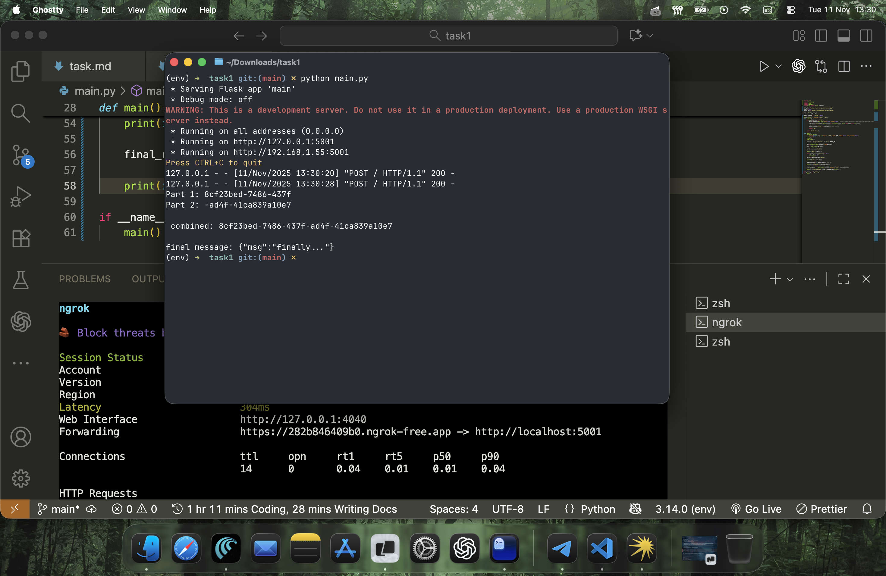

## UZ

Taskni tugatdim. Men bajargan ishlar: men msg va url(webhook uchun, part2 yuborilishi uchun)ni berilgan manzilga yuboraman. U yerdan esa kelgan javobni(part1)ni saqlab olib, Webhookdan keladigan javobni tinglayman, part2'ni olaman(yuborilguncha kutaman). part2 kelsa men part1 bilan birlashtiraman va eng birinchi manzilga so'rov yuboraman(birlashgan kod bilan). Qaytgan javobni esa consoleda ko'rsataman. Mening buni tuzish yo'limni(muammolarni, jarayonni) timeline.md faylidan o'qing

 1. Men so'rov yuborish uchun request ishlatdim(requirements.txt).
 2. Men so'rovlarni webdan qabul qilish uchun flask ishlatdim
 3. Men global manzil uchun ngrok ishlatdim(tarmoqchi ham sinab ko'rdim)
 4. Barchasi bitta faylda. Men flask appni boshqa threadda ishga tushirdim. Chunki flask app webhookni kutadi. appni block qiladi. To'g'ri, men shunchaki hammasini teskari yozishim mumkin edi, lekin thread bilan ham muammo bo'lmaydi. o'qishga qulayroq, tepadan pastga qarab o'qib ketiladi

## ENG
i completed the task. here’s what i did: i sent the message and url (for the webhook, where part2 would be sent) to the given address. from there, i received the response (part1), stored it, and waited for the webhook response to get part2. once part2 arrived, i combined it with part1 and sent the merged data back to the initial address. the final response was shown in the console. for more details about my process and the issues i faced, check the timeline.md file.

1.	i used the requests library to send requests (listed in requirements.txt).
2.	i used flask to handle incoming requests from the web.
3.	i used ngrok for a global address (and also tested tarmoqchi).
4.	everything is in a single file. i started the flask app in a separate thread because it waits for the webhook and would block the main flow otherwise. it’s true that i could have written it in reverse order, but using threads works fine and makes the code easier to read from top to bottom.

